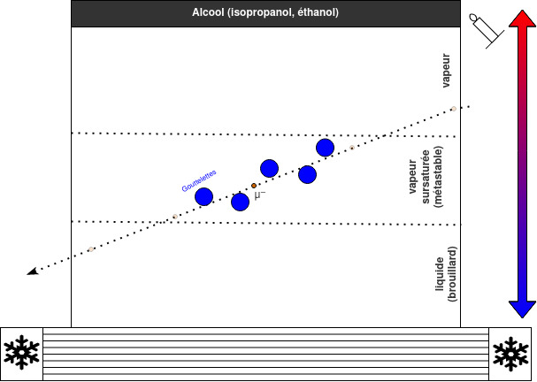

# Chambre à brouillard

Ce projet recence les resources pour la construction et l'utilisation de la chmabre à brouillard du club [Le Télescope](https://github.com/letelescope/): 

 - Bibliopgraphie
 - Plan, schémas, détails et liste des composants
 - Instructions de montage
 - Guide d'utilisation
 - ...

## Une chambre à brouillard Kézako ? 

Nous sommes en permanence bombardés de rayonnements/particules qui nous sont invisibles: Muons, Neutrinos, proton, α,...). Ces rayonnements bien qu'invisibles à nos sens sont détectables par des détecteurs de particules. L'un des plus anciens types de détecteur pour les particules chargées est la chambre à brouillard, c.f. [wikipedia](https://fr.wikipedia.org/wiki/Chambre_%C3%A0_brouillard).

Le principe de la chambre à brouillard est toujours un peu près le même. L'idée est de créer les conditions pour avoir de la vapeur (d'eau ou d'alcool) sursaturé, ex: 
- Par détente du volume de gaz - Chambre à expansion de Wilson
- Par refroidissement - Chambre à diffussion de Langsdorf

La vapeur sursaturée est métastable. A la moindre perturbation elle condense. Au passage d'une particule chargée (rayon cosmique par exemple), la vapeur va alors condenser et former des petites gouttelettes qui vont rester un temps en suspension formant une traînée trahissant le passage de la particule. Un dessin valant mieux qu'un long discours, voici un petit schéma récapitulatif:

## Une chambre DIY/amateur ?

Bien qu'étant des détecteursd de particules subatomitques, de telles chambres sont réalisatbles avec des objets de la vie de tous les jours ! [K. Yoshinaga et al](https://indico.cern.ch/event/335863/contributions/785342/attachments/1168798/1686802/cloudchamber_salt_ice_mix.pdf). 

La problématique est souvent de trouver la source froide. Le plus simple (quand on y a accès) c'est d'utiliser de la glace carbonique. Mais bon, n'habitant pas aux USA et la glace carbonique ayant une facheuse tendance à la sublimation, il existe plein d'autres solutions:
+ Allant des plus simple avec de l'eau chaude et un puit de chaleur : https://www.youtube.com/watch?v=gt3Ad5_Z5IA
+ En compliquant un peut avec des cellules peletier : https://www.youtube.com/watch?v=-Cu3wW8rNAs&t=795s
+ En poussant le bouchon assez loin avec des compresseurs, des résistance chauffante des réservoirs à alcool : https://www.youtube.com/watch?v=Q9hsxNFoDf8&t=571s

Afin d'avoir une solution, "légère", "transportable", facile d'utilisation (sans avoir besoin de cryogénique), et en avec un bufget tenu, nous explorons ici la réalisation d'une **chambre à diffusion refroidie par cellules Peltier**. 
